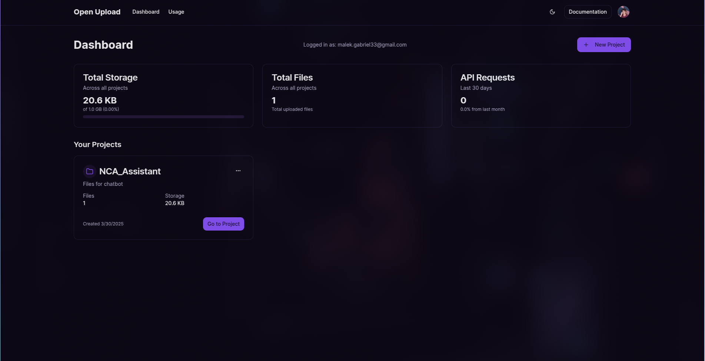
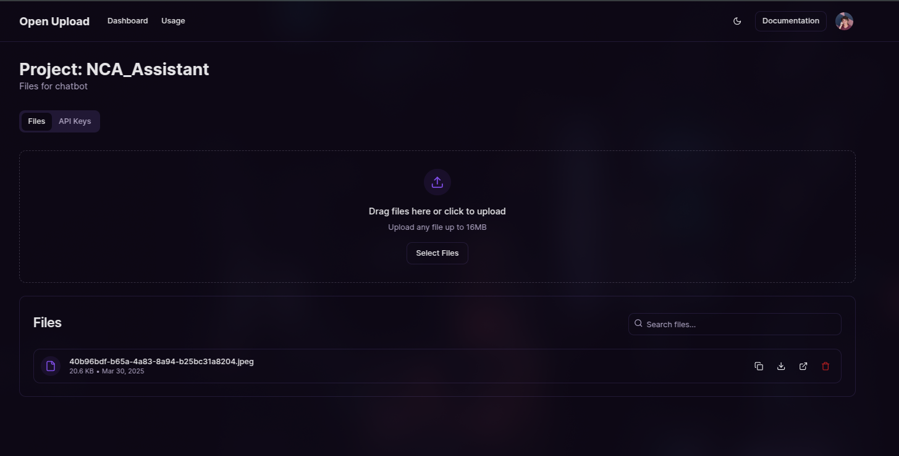
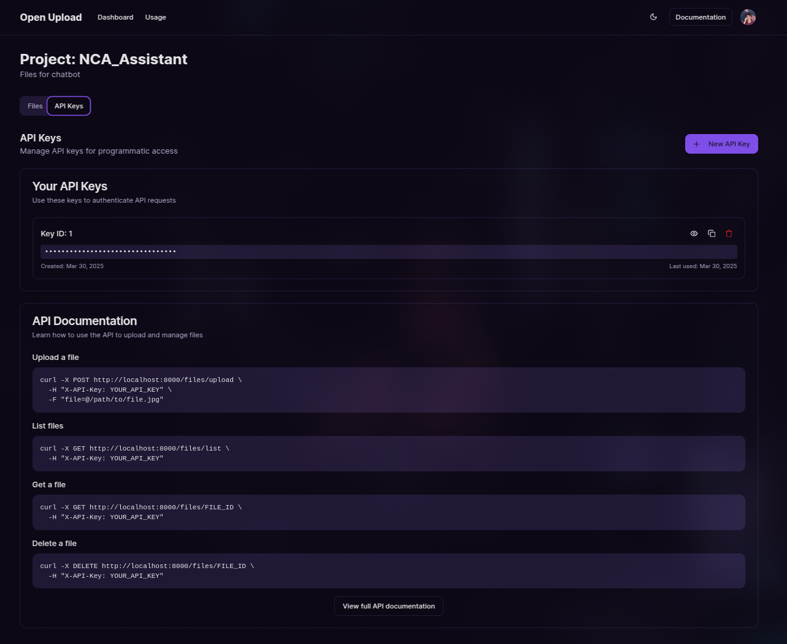

# Open Upload (Placeholder Name)

An open-source file uploader service, similar in concept to UploadThing, allowing users to manage projects, generate API keys, and upload files.

## Features

*   **File Uploads:** Securely upload and manage files.
*   **Project Management:** Organize uploads into different projects.
*   **API Key Management:** Generate and manage API keys for programmatic access.
*   **User Authentication:** Sign up, log in, and manage user profiles.
*   **Usage Tracking:** Monitor file storage and bandwidth usage (implementation details TBC).
*   **Dashboard:** User-friendly interface for managing projects, files, API keys, and settings.
*   **(Potential) Billing:** Infrastructure for billing based on usage (implementation details TBC).

## Tech Stack

*   **Backend:**
    *   Python
    *   FastAPI
    *   SQLAlchemy (likely, based on `database.py`, `models.py`)
    *   Firebase Authentication
    *   Uvicorn (web server)
    *   uv (package management)
*   **Frontend:**
    *   Next.js
    *   React
    *   TypeScript
    *   Tailwind CSS
    *   Shadcn UI
    *   pnpm (package management)
    *   pnpm (package management)

## Getting Started

### Prerequisites

*   Python (version specified in `.python-version`, likely 3.10+)
*   Node.js (LTS version recommended)
*   pnpm (`npm install -g pnpm`)
*   Firebase Project and Service Account Credentials

### Installation & Setup

1.  **Clone the repository:**
    ```bash
    git clone <repository-url>
    cd open_upload
    ```

2.  **Backend Setup:**
    *   Navigate to the backend directory: `cd backend`
    *   Install Python dependencies using uv:
        ```bash
        # Ensure you have the correct Python version activated
        uv pip install -r requirements.txt # Or based on pyproject.toml/uv.lock if applicable
        ```
    *   **Configure Environment:**
        *   Set up Firebase: Place your Firebase service account key JSON file as specified in `backend/firebase/firebase_credentials.py` (or modify the code to load it securely, e.g., via environment variables).
        *   Configure other necessary environment variables (e.g., database connection if not using SQLite default, secrets). Create a `.env` file if needed.
    *   Initialize the database (if required, check `database.py` or `main.py` for setup logic):
        ```bash
        # Example: Might need a command like this, adjust as necessary
        # uvicorn main:app --run-migrations # Or a specific script
        ```
    *   Run the backend server:
        ```bash
        uvicorn main:app --reload --port 8000
        ```

3.  **Frontend Setup:**
    *   Navigate to the frontend directory: `cd ../frontend`
    *   Install Node.js dependencies:
        ```bash
        pnpm install
        ```
    *   **Configure Environment:**
        *   Create a `.env.local` file.
        *   Add the backend API URL: `NEXT_PUBLIC_API_URL=http://localhost:8000` (adjust port if necessary).
        *   Add Firebase configuration details needed for the frontend client (`frontend/lib/firebase.ts`).
    *   Run the frontend development server:
        ```bash
        pnpm dev
        ```

4.  **Access the application:** Open your browser and navigate to `http://localhost:3000`.

## Configuration

Ensure the following environment variables or configuration files are set up correctly:

*   **Backend:**
    *   Firebase Service Account Credentials (`backend/firebase/firebase_credentials.py` or environment variables)
    *   Database Connection String (if applicable)
    *   JWT Secret Key (if used for session management beyond Firebase)
*   **Frontend:**
    *   `NEXT_PUBLIC_API_URL`: The URL of the running backend API.
    *   Firebase Client SDK Configuration (`frontend/lib/firebase.ts`)

## License

This project is licensed under the MIT License. See the [LICENSE](LICENSE) file for details.

## Contributing

Contributions are welcome! Please feel free to submit issues and pull requests.
(Add more specific contribution guidelines if desired).

## Screenshots

Here are some glimpses of the application:

**Dashboard:**


**Projects Page:**


**API Keys Page:**

